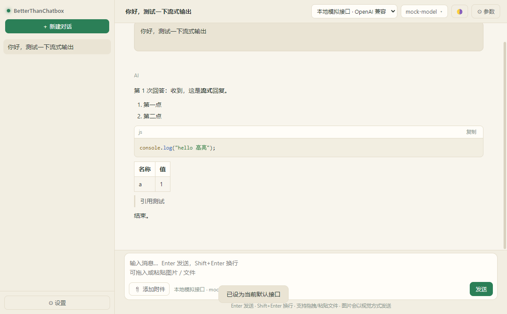
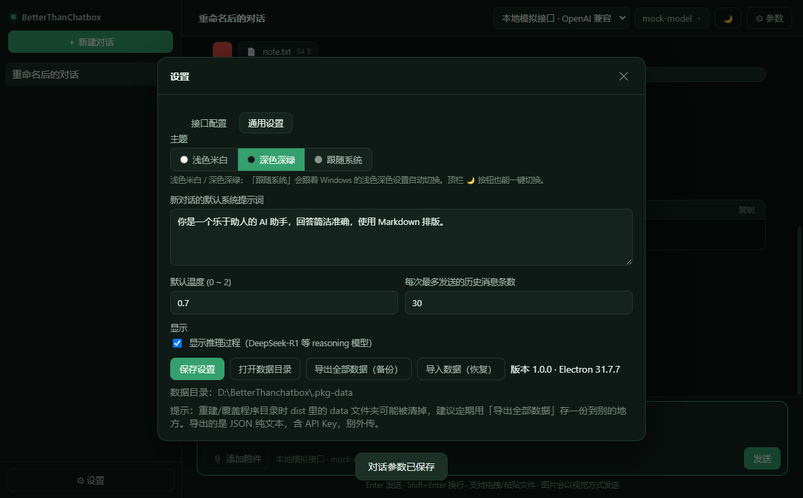
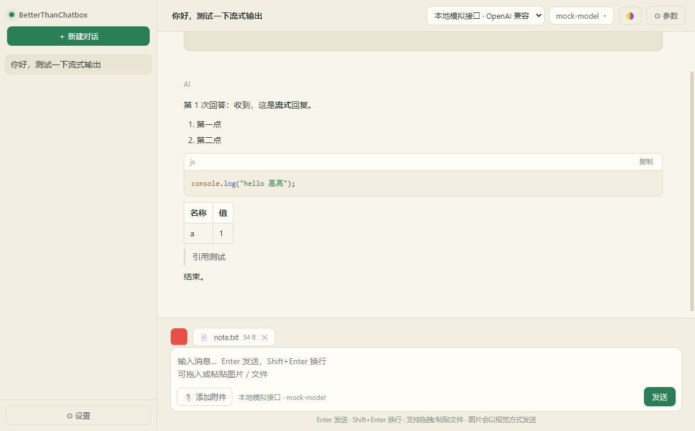

# BetterThanChatbox

[](LICENSE)
[](#打包成免安装-exe)
[](package.json)
[](https://github.com/3b2ht90/BetterThanChatbox/releases/latest)

**自己填 API Key 就能用的极简 AI 聊天桌面软件。**
不用注册、不用登录、不用装任何东西 —— 填上接口地址、密钥、模型名，就能开始聊。

- **三种协议一套界面**：OpenAI 兼容（DeepSeek / OpenRouter / 硅基流动 / 中转站 / Ollama…）、Anthropic Claude、Google Gemini
- **能发图、能发文件**：图片按视觉消息发；Word / Excel / PPT / PDF 自动提取正文一起发
- **能读本地文件夹**：在消息里发一个文件夹路径（如 `D:\项目A`），应用把里面的文档读出来一起发给 AI；回答满意就点「保存到 项目A/」，总结直接落进那个文件夹
- **对话都在本地**：流式输出、Markdown + 代码高亮、新建/删除/重命名、导出成 Markdown



<details>
<summary>深色主题 / 附件（点击展开）</summary>





</details>

## 为什么用它：简单、轻量

### 简单

| | |
| --- | --- |
| **三步开始** | 设置里填 Base URL + API Key + 模型名 → 关掉设置 → 开始聊。没有引导流程、没有账号、没有订阅页 |
| **一个文件装下所有数据** | 对话、消息、设置、接口配置全在 `data.json`；附件在同目录 `files\`。想备份就复制文件夹，想恢复就粘回去 |
| **不联任何第三方服务器** | 只连你自己填的那个接口。没有账号体系、没有云端同步、没有埋点上报、没有更新检查 |
| **三种协议不用装三个客户端** | DeepSeek / Claude / Gemini / 各种中转站，同一套界面，顶栏下拉切换 |
| **模型切换是下拉** | 顶栏点模型名就能换（列表来自接口、本机用过的模型、常用模型三组，可搜索、可自己输） |

### 轻量

下面是 `npm run build` 之后的**实测数字**，不是估的：

| 项目 | 实测 |
| --- | --- |
| 应用代码 | **12 个文件 / 4,192 行 / 167 KB**（`app/` 全部 JS + HTML + CSS） |
| 运行时依赖 | **只有 2 个** —— `marked`（渲染 Markdown）和 `highlight.js`（代码高亮）。没有几百个包的 `node_modules` |
| 打包产物里的应用本体 | **408 KB**（应用代码 + 图标） |
| 免安装文件夹总共 | 265 MB，其中 **255 MB 是 Electron(Chromium) 运行时本体** |
| 安装 | **不需要**。拷到哪、双击 `BetterThanChatbox.exe` 就能跑 |
| 卸载 | 删掉文件夹（不写注册表、不装服务、不留后台常驻进程） |

> 关于 265 MB：这个数字看着不小，但它几乎全是 Electron 运行时（Chromium + Node）—— 这是所有 Electron 桌面应用的共同底座，这个软件自己的代码只占 408 KB。
> 选 Electron 换来的是：不用装 Python/Node/.NET 运行环境，Windows 上双击即用。**如果只算这个软件自己的部分，它是 167 KB 源码 + 2 个依赖。**

零外部服务依赖：解析 docx / xlsx / pptx 用的是 Node 内置 `zlib` 自己写的 ZIP + OOXML 解析（约 240 行），没有引入 `officeparser`、`mammoth` 之类的库；图标是启动 Electron 离屏窗口用 HTML/CSS 画出来再拼成 `.ico`（`scripts/make-icon.cjs`），没有用图片素材。

## 读本地文档 / 把结果存回本地

### 用法

1. 在输入框里直接写上文件夹路径，比如：

   ```
   帮我总结一下 D:\项目A 这个文件夹里的内容
   ```

2. 输入框上方会出现一条提示：`📁 项目A/ · 12 个可读文件 · 340 KB · 发送时读取内容`。
   点右边的 ✕ 可以这次不读它 —— **发之前你看得到会读什么**。
3. 点发送。应用会把文件夹里的文档正文（含每个文件的分节标题、以及"哪些文件没读、为什么没读"的清单）一起发给 AI。
4. AI 回答下面会多一个按钮 **「💾 保存到 项目A/」**，点一下就存进那个文件夹（默认文件名取回答里的第一个标题 + 日期，重名会先问你要不要覆盖）。

单个文件路径也行（`D:\报告.docx` 直接当附件发），并且和拖拽文件走同一条路。

### 为什么是"应用去读"，而不是让 AI 自己调工具

- **模型读不到你没指定的文件**。文档正文里可能藏着"顺便读一下 `~/.ssh`"这种注入指令，如果给模型工具权限就真的会去读；
  现在是应用认路径、应用去读，模型只拿到你点过头的那份内容。
- **所有接口都能用**。不需要模型支持 function calling —— DeepSeek、中转站、本地 Ollama 上的小模型都能用。
- **不会偷偷动你的文件**。写文件必须你点按钮，且默认目标就是你自己给的那个文件夹。

### 上限与保护

| 限制 | 值 | 说明 |
| --- | --- | --- |
| 单次最多读 | 40 个文件 | 超出只读前 40 个，并在概览里说明 |
| 目录深度 | 3 层 | 更深的目录只列名字 |
| 单个文件 | 5 MB | 更大的只列名字 |
| 正文总量 | 20 万字符 | 到顶就停，并注明 |
| 自动跳过的目录 | `node_modules`、`.git`、`__pycache__`、`.venv`、隐藏目录等 | 会在概览里列出来 |
| 直接拒绝 | 盘符根目录（`C:\`、`D:\`）、`C:\Windows`、`Program Files`、`ProgramData` | 避免把整个盘读进来 |
| 图片 | 只列名字，不当附件发 | 一个文件夹几十张图全发出去太贵，需要的话单独拖进来 |

正文**不存进 `data.json`**：消息里只记路径和文件清单，真正的内容在发请求那一刻现读。所以对话记录不会因为读过一个大文件夹而膨胀，内容也永远是最新的。

## 完整思考过程

用推理模型（DeepSeek-R1、Claude 带 thinking、Gemini 2.5 等）时，思考过程会**逐字**显示在回答上方：

- **不截断、不摘要**：接口吐多少就显示多少，界面上的文本与接口返回的**逐字符一致**（有端到端测试盯着这条）
- 默认展开，想看多久看多久；长思考内部可滚动，点「展开」还能解除限高一次铺开
- 标题上实时显示字数（`💭 正在思考… 15,186 字`），可以折叠成一行、也可以整段复制
- 写进对话存档，**刷新/重开软件后还在**；导出 Markdown 时放进 `<details><summary>思考过程</summary>` 折叠块

### 背后要处理的三家差异

| 协议 | 怎么拿到思考 |
| --- | --- |
| OpenAI 兼容 | 自动返回，字段名各家不同：DeepSeek 用 `reasoning_content`、OpenRouter 用 `reasoning`、少数中转站用 `thinking` —— 三个都认；对 OpenRouter 还会显式带上 `reasoning: {enabled: true}` |
| Anthropic | **必须主动请求**（`thinking: {type:'enabled'}`），不请求就一个字都不返回；开启时按接口要求不再传 `temperature`（接口只允许 1 或不传） |
| Google Gemini | 需要 `thinkingConfig.includeThoughts`；`thought: true` 的片段单独归到思考里，**不会混进正式回答** |

**不支持时自动降级**：如果某个模型不认识思考参数（比如 Claude 3.5 这类老模型），接口会返回 400，
程序会**去掉参数重试一次**，对话不会因为"想显示思考"而失败 —— 只在界面上提示一句「本次没有思考过程」。
另外「设置 → 通用设置 → 显示模型的思考过程」可以整体关掉。

## 功能

- **接口自己配**：Base URL + API Key + 模型名，随便填（DeepSeek、OpenRouter、硅基流动、各种中转站、Ollama/LM Studio 本地模型都能接）
- **三种协议**：OpenAI 兼容（默认）、Anthropic Claude 官方、Google Gemini 官方；可以在同一份配置里存多个接口随时切换
- **发图**：图片以「视觉消息」发送（多模态），不是只发文件名
- **发文件**：文本/代码文件自动读取内容一起发；**Word / Excel / PPT（docx / xlsx / pptx）自动提取正文**；PDF 也会尝试提取文字；其它二进制格式只发文件名（会提示）
- **对话管理**：新建、删除、重命名（侧栏 ✏️ 或直接改顶栏标题）
- **导出对话**：侧栏每条对话上的 ⬇ 按钮，导出成 Markdown（带元信息、代码块、附件清单、思考过程折叠块）或 JSON（保留全部版本，可再导入）
- **导入对话**：侧栏的「⬆ 导入」按钮，支持本软件导出的 JSON、Markdown，以及整库备份文件；**只追加，不覆盖**现有对话
- **备份 / 恢复**：设置 → 通用设置 → 「导出全部数据」把接口配置、设置、全部对话存成一个 JSON；换机器或重装后用「导入数据」整体恢复（导入前会自动把现有数据另存一份）
- **流式输出**：打字机效果，可随时「停止」
- **完整思考过程**：推理模型的思考过程逐字显示（不截断、不摘要），可折叠、可整段复制、写进对话存档、导出也带着
- **重新回答 / 对话分支**：回答不满意点「重新回答」，旧回答不会丢——同一条消息存多个版本，标题旁用 `‹ 2/3 ›` 前后切换，选中的那一版才参与后续对话
- **编辑提问也开分支**：点提问上的「编辑」改完保存，旧提问和旧回答都留作历史版本，可随时切回去对比
- **Markdown 渲染**：标题、列表、表格、引用、代码块语法高亮 + 一键复制
- **每个对话单独设置**：系统提示词、温度、**最大输出 tokens**、模型、用哪个接口
- **最大输出 tokens 可调**：控制单次回答最多多长。全局默认在「设置 → 通用设置」，单个对话可在「对话参数」里覆盖；**填 0 = 不限制**（交给接口自己的默认值）。三家协议字段各不相同，程序会自动用对：OpenAI 兼容发 `max_tokens`、推理模型（o 系列/gpt-5）改发 `max_completion_tokens`、Claude 发 `max_tokens`、Gemini 发 `generationConfig.maxOutputTokens`
- **模型下拉快捷切换**：顶栏点模型名就能从下拉里挑（列表来自接口、本机用过的模型、常用模型三组，可搜索、可直接输入自定义模型名）；打开面板时会自动去接口拉一次模型列表并缓存下来，旁边 ↻ 可手动刷新
- **深浅色主题**：浅色米白 / 深色深绿 / 跟随系统，顶栏一键切换，首屏不闪色
- **本地保存**：对话、设置、附件全部存在本机，关掉再打开还在

## 运行（开发模式）

```powershell
npm install
npm start
```

## 打包成免安装 exe

```powershell
npm run build
```

产物目录（整个 `BetterThanChatbox` 文件夹拷到哪都能双击运行，无需安装，约 265 MB，其中 255 MB 是 Electron 运行时）：

```
dist\BetterThanChatbox\
  BetterThanChatbox.exe   ← 双击这个（约 6 KB 的启动器）
  使用说明.txt
  app-runtime\            ← 程序本体：Electron 运行时 + 应用代码，别单独移动
```

### 做成 Release 压缩包（解压即用）

```powershell
npm run build
# Windows 10/11 自带 tar.exe 就能写 zip：255 MB 压到约 107 MB
tar -a -c -f release\BetterThanChatbox-v1.0.0-win-x64.zip -C dist BetterThanChatbox
gh release create v1.0.0 release\BetterThanChatbox-v1.0.0-win-x64.zip `
  --title "BetterThanChatbox v1.0.0 — 解压即用版" --notes-file release\RELEASE_NOTES.md
```

打包前记得删掉 `dist\BetterThanChatbox\data\`（那是本机跑测试留下的浏览器缓存，不该发给用户）。
压缩包里的顶层目录就是 `BetterThanChatbox\`，用户解压后双击里面的 exe 即可。

> 现成的下载：<https://github.com/3b2ht90/BetterThanChatbox/releases/latest>

### 应用图标

图标是**用程序画出来的**，不是外部素材：`scripts/make-icon.cjs` 开一个 512×512 的离屏窗口，
用 HTML/CSS 画出「深绿方块 + 米色文字」再截图，然后自己拼出 16~256 七个尺寸的 `.ico`。

**大小尺寸画的是两套东西**：64px 及以上是 `Better / Than / Chatbox` 三个单词各占一行；48px 及以下是 **BTC** 字母组合。
（三行文字缩到 16px 会糊成一团，所以小图标换字母。）

脚本还会**自己检查有没有画坏**：量出米色文字的包围盒，一旦贴到画布边缘就报错退出——
字号过大被截掉这种事，肉眼看小图是看不出来的。

```powershell
# 重新生成 assets\icon.ico 与 assets\icon.png（受限环境要带 --no-sandbox）
node_modules\electron\dist\electron.exe --no-sandbox scripts\make-icon.cjs
```

图标在三个地方生效：

| 位置 | 怎么生效 |
| --- | --- |
| 窗口 / 任务栏 | `app/main.js` 里 `new BrowserWindow({ icon: assets/icon.ico })` |
| 双击的 `BetterThanChatbox.exe` | `scripts/build-portable.mjs` 用 `csc /win32icon:assets\icon.ico` 编译启动器 |
| 打包后的应用内部 | `assets\` 会被一并复制进 `app-runtime\resources\app\` |

改了图标只要重新 `npm run build` 就会带上；`assets\icon.ico` 本身也提交在仓库里。

### 为什么入口是一个启动器，而不是直接把 electron.exe 改名

Electron 在受限环境里（被别的沙箱/受限令牌包着启动时）Chromium 的沙箱会初始化失败，进程会在 **JS 还没开始执行**的时候就以 `0x80000003` 退出——表现就是"双击 exe 毫无反应"。

因为崩溃早于 `main.js`，**在应用代码里写 `--no-sandbox` 是没用的**（实测：给 main.js 加写文件探针，裸启动时那个文件根本不会产生）。所以只能由外部启动参数解决，于是有了启动器：它依次尝试下面 5 种组合，某一套让进程活过 1.5 秒即视为成功。

```
1. （默认，带 Chromium 沙箱）              ← 环境正常时用这套，不无谓降低安全性
2. --no-sandbox
3. --no-sandbox --disable-gpu
4. --no-sandbox --disable-gpu-sandbox
5. --no-sandbox --disable-features=RendererCodeIntegrity
```

用户全程不需要 bat、也不需要手输参数。实测在"被别的沙箱包着启动"的环境里：第 1 套必挂 `0x80000003`、第 2 套必成功（连测 4 轮结果完全一致）。

万一 5 套都没起来，程序会弹窗提示，并在同目录写一份 `启动日志.txt`（记录每次尝试的参数与退出码），把它发出来即可定位。

启动器顺带处理另外两件事：环境里不可写的 `%TEMP%`/`%APPDATA%`/`%LOCALAPPDATA%` 换成程序目录下对应目录；把程序根目录经 `BTC_APP_HOME` 传给主进程，好让主进程在 `%APPDATA%` 不可写时把数据退到 `程序目录\data\`。

## 自动化测试

```powershell
npm test         # 单元测试：三种协议的请求构造、流式解析、错误提示、Markdown 渲染（48 项）+ 消息多版本 / 分支（38 项）
npm run test:office # Office 文档提取：docx 正文与表格、xlsx 共享字符串与多表、pptx 分页（34 项）
npm run test:payload # 端到端：拦截真实发出的请求体，确认 docx 内容确实到了 AI 那边（20 项）
npm run test:export # 导出 / 备份：Markdown 结构、多版本提示、附件清单、备份校验、真写文件再读回来（43 项）
npm run test:store-guard # 数据文件自保：带 BOM、被截断、类型不对时都不能静默丢数据（12 项）
npm run test:model-options # 模型下拉的列表来源：预设猜测、分组去重、不串台（24 项）
npm run test:localfs # 本地路径识别与文件夹读取：路径认取、上限、跳过规则（47 项）
npm run test:import # 导入对话：JSON / Markdown / 备份解析、附件丢失处理、导出入往返（42 项）
npm run test:reasoning # 思考过程：三家协议的字段差异、主动请求、不支持时自动降级（17 项）
npm run test:launcher # 启动器：退出码语义、数据目录探测、不把别人的 Electron 当成自己（18 项）
npm run test:datadir # 数据目录：打分选目录、不可写时搬家不丢数据、附件一起搬（18 项）
npm run test:context # 上下文：token 估算、窗口匹配、用量百分比、压缩挑选规则（21 项）
npm run e2e:export # 导出端到端：走打包产物，点真按钮 → 换掉原生保存框 → 校验落盘内容（23 项）
npm run e2e:models # 模型下拉端到端：起假接口 → 点开下拉 → 选模型 → 确认对话的 model 真改了（27 项）
npm run e2e:local  # 本地文档端到端：造文件夹 → 输入框发路径 → 校验请求体带正文 → 点保存 → 校验文件落进该文件夹（21 项）
npm run e2e:import # 导入端到端：导出 → 清空 → 点导入 → 校验对话回来；再导整库备份验证只追加（21 项）
npm run e2e:reasoning # 思考端到端：假接口吐 1.5 万字思考，校验界面上逐字符一致、可折叠、刷新还在、导出完整（16 项）
npm run e2e:streamerr # 断线端到端：假接口中途掐断连接，校验提示是中文说明、部分内容不丢、重试能拿到完整回答（11 项）
npm run e2e:context # 上下文端到端：灵动岛默认收起/点开才展开、真点压缩 → 旧消息不再进请求体但摘要进了 → 展开原文 → 取消压缩 → 被截断时有明确提示（32 项）
npm run smoke    # 界面冒烟测试（开发模式）：真起一个窗口，连本地假接口跑完整流程
npm run smoke:pkg # 界面冒烟测试（打包产物）：走 dist 里的启动器，等同于用户双击（90 项）
```

`test:office` / `test:payload` 用的是仓库里 `test-fixtures/office/` 下已提交的样本文件，直接就能跑。
想重新生成样本（需要 python + python-docx / python-pptx / openpyxl）：

```powershell
python scripts\make-office-fixtures.py test-fixtures\office
```

（样本别放 `test-artifacts/`：那个目录是冒烟测试的派生目录，`smoke-driver.js` 每次开跑都会整个删掉重建。）

它的做法是**先造内容已知的文件，再断言提取结果必须包含这些字符串** —— 不是"跑通就算过"。
`test:payload` 更进一步：把 `global.fetch` 换成假的，捕获 OpenAI / Anthropic / Gemini 三种协议
真正发出去的请求体，断言 docx 正文出现在里面（而不是只有文件名），同时回归验证图片仍然走视觉通道。

两个冒烟测试都会写截图 + `test-artifacts/report.json`。

`npm run smoke` 会覆盖：配置接口 → 发消息（流式/代码块/表格渲染）→ 拖入图片和文本文件 → 校验发出去的请求体里图片确实是 data URL、文本附件内容确实被带上 → 重命名 → 新建 → 删除 → 对话参数保存 → 主题切换（浅色/深色/跟随系统 + 顶栏按钮 + 重载后首屏配色 + 文字对比度 ≥ 4.5 + 窗口原生底色跟着换）→ 重新回答/分支（多版本、`‹ n/m ›` 切换、编辑提问开分支、成对对齐、旧数据自动迁移）→ 持久化落盘。

截图无法人工查看时，可以用 `node scripts/png-mean.mjs test-artifacts/*.png` 打出每张图的平均颜色和亮度，确认浅色主题确实偏亮、深色主题确实偏暗且偏绿。

## 怎么用

1. 打开软件 → 左下角 **⚙ 设置**
2. **接口配置** → `＋ 添加接口`，选接口类型，填 Base URL / API Key / 模型名 → 保存
   - DeepSeek：类型 `OpenAI 兼容`，Base URL `https://api.deepseek.com/v1`，模型 `deepseek-chat`
   - OpenAI：类型 `OpenAI 兼容`，Base URL 留空，模型 `gpt-4o-mini`
   - OpenRouter：`https://openrouter.ai/api/v1`，模型如 `anthropic/claude-3.5-sonnet`
   - Claude 官方：类型 `Anthropic Claude 官方`，Base URL 留空，模型 `claude-3-5-sonnet-latest`
   - Gemini 官方：类型 `Google Gemini 官方`，Base URL 留空，模型 `gemini-2.0-flash`
   - 点 **获取模型列表** 可以直接拉出该接口可用的模型名
3. 回到主界面开始聊天。发送框里：
   - `Enter` 发送，`Shift+Enter` 换行
   - 📎 添加附件，或直接把文件/图片**拖进窗口**、直接 `Ctrl+V` 粘贴截图
   - 点顶栏 **⚙ 参数** 可给当前对话单独设置系统提示词/温度/模型

## 重新回答 / 对话分支

回答不满意不用重开对话，直接在旧回答上重来，**旧回答不会被删**：

- **重新回答**：鼠标移到 AI 回答上 → 点「重新回答」。同一个位置会生成新的一版，标题旁出现 `‹ 2/3 ›`，点 `‹` `›` 在版本之间来回切（循环），当前显示的那一版才是后面要发送的上下文。
- **编辑提问**：鼠标移到自己的提问上 → 点「编辑」，就地改成新问题 → `Enter` 保存（`Shift+Enter` 换行、`Esc` 取消）。旧提问留作历史版本，紧跟其后的那条 AI 回答也会自动重新生成一版，提问和回答的版本号成对对齐（切到第 2 版提问，看到的也是配套的第 2 版回答）。
- **删除**：只删当前消息（连同它的所有版本）；「重新回答」是唯一会新增版本的操作。
- 版本数超过 1 才显示 `‹ n/m ›`；只有一个版本时界面和以前一样干净。
- 老对话（升级前存的）会自动迁移成"每条第 1 版"，行为和以前完全一致。
- 注意：重新回答只影响这一条消息本身，**不会**顺手改写后面已经生成的内容；如果这条消息后面还有对话，那些内容是当时基于旧回答生成的，需要的话可以手动再点它们的「重新回答」。

## 主题（浅色米白 / 深色深绿）

两种配色：

| | 配色 |
|---|---|
| **深色深绿** | 墨绿黑底 + 薄荷绿主色，代码高亮是深色主题的配色 |
| **浅色米白** | 米白/暖白底 + 深绿主色，代码高亮换成浅色配色 |

两种切换方式：

- 顶栏的 **☀ / 🌙 / 🌗** 按钮：单击在浅色和深色之间来回切（按钮图标显示当前是什么模式）
- **⚙ 设置 → 通用设置 → 主题**：三段式选择「浅色米白 / 深色深绿 / 跟随系统」，选「跟随系统」时 Windows 切换深浅色，软件会自动跟着变

选完立刻生效并写入 `data.json`（`settings.theme`），重启后还在。

**首屏不闪色**：窗口底色和 `<html data-theme>` 都在页面脚本执行之前就按保存的主题定好了（preload 在 document-start 阶段向主进程同步取一次），所以选了米白主题打开时不会先闪一下深色。

## 导入对话

侧栏「＋ 新建对话」旁边的 **「⬆ 导入」**，可以选一个或多个文件：

| 文件类型 | 导入结果 |
| --- | --- |
| 导出的 **JSON**（`⬇` 按钮选 JSON 存出来的） | 1 个对话，保留全部消息版本、附件记录 |
| 导出的 **Markdown** | 按 `## 👤 用户` / `## 🤖 AI` 分段还原成多条消息；思考过程、附件清单也认；认不出分段就当一整篇（不会失败） |
| **整库备份**（设置里「导出全部数据」出来的） | 备份里的每个对话各导入一份 |
| 其它 `.md` / `.txt` | 整篇作为一条 AI 消息，标题取第一个 `#` 标题行 |

几条行为约定：

- **导入是「追加」，不是覆盖**：现有对话一个都不会动（要整体替换请用设置里的「导入数据」）
- 导入的对话**不自动绑定接口** —— 那是别人机器上的配置，进去后在顶栏选一个自己的接口即可
- 导入前会先把当前 `data.json` 自动另存一份（`data.json.bak-<时间>`），出意外有退路
- 附件原文件在别的电脑上时，**只保留名字并标明「原文件不在本机」**；文本 / PDF / Office 附件的正文是存在导出文件里的，所以内容还能看
- 重复导入同一个文件会得到多份对话（故意不按标题去重 —— 你可能就是想留两份）

## 出错时你会看到什么

失败信息**一律是中文、并说清怎么处理**，不会把底层网络库的原始英文透传给你
（以前流式中途断线会显示 `⚠️ terminated`，完全看不懂）：

| 情况 | 界面提示 |
| --- | --- |
| 回答到一半连接被掐断 | 「回答被中断：接口在回复过程中断开了连接（常见于中转站或代理超时、网络不稳、服务端限流）。**已经收到的部分保留在上面**，可以点「重新回答」再试一次。」 |
| 域名解析不了 | 「网络错误：无法解析接口域名，请检查 Base URL 与网络连接。」 |
| 端口没人听 | 「连接被拒绝：接口地址或端口不正确，服务没有在运行。」 |
| 证书有问题 | 「HTTPS 证书校验失败：请检查接口地址或代理设置。」 |
| 请求超时 | 「请求超时：接口长时间没有响应。」 |

断线时**已经收到的部分回答不会丢**：它留在气泡里；「重新回答」产生的新版本会记成第 2 版，
随时能用 `‹ 1/2 ›` 切回去比较。

### 双击没反应怎么办

程序入口 `BetterThanChatbox.exe` 是一个**启动器**（受限环境里 Chromium 沙箱会在 JS 起来之前就崩，
必须由外部参数补救）。它的规则是：

- 依次尝试 5 组参数，「进程能活过 1.5 秒」才算启动成功
- **退出码 3** = 已经有一个实例在运行 → 把那个窗口调到前台，不算失败
- **退出码 4** = 数据目录写不进去 → 自动把数据目录重定向到程序目录后重试
- 真的全都失败时：**弹窗说明 + 在程序目录写 `启动日志.txt`**（里面记录了每一次尝试的退出码）

所以正常情况下"双击没反应"是不会再出现的；万一遇到，把 `启动日志.txt` 发出来就能定位。

> 排查用的通用工具：`node scripts/check-path.js "你的那句话"` 可以看程序会认出哪些本地路径。

## 数据安全：不会"一更新就丢东西"

这一版把「数据看起来消失了」的几条路径都堵死了：

**① 每次启动自动留快照**
程序每次启动都会把上一份 `data.json` 复制到数据目录下的 `backups\`，
保留最近 20 份 + 每天一份。**你不需要记得手动备份。**
设置 → 通用设置 → 「自动备份…」可以看到快照清单（每份含几个接口、几个对话、几条消息）并一键恢复；
恢复前当前数据也会自动留一份。

**② 数据目录写不进去时，会"搬"而不是"换"**
`%APPDATA%\BetterThanChatbox` 因为权限、安全软件、只读盘等原因写不进去时，
程序**不会**默默换一个空目录继续跑（那样你会看到一片空白、以为数据被删了），
而是把你的 `data.json` 和 `files\` **复制**到可写的目录再继续，并在界面上说明搬到了哪里。
**源目录的东西一律不删**，目标目录里已有的文件也会先另存成 `.replaced-<时间>`。

**③ 选哪个目录，看的是"哪里有数据"，不是"哪里能写"**
程序按「接口数 + 消息数」给每个候选目录打分，优先用真正有数据的那个；
空壳目录（只有个空对话）不算数。这样 `%APPDATA%` 可写性一变，也不会换到空目录上去。

**④ 坏文件不再静默清空**
`data.json` 带 BOM 会自动去 BOM；真的损坏时会另存为 `.unreadable-<时间>` 再启动，并在界面上告诉你。

> 需要独立备份的话，设置里「导出全部数据」可以存一份到你指定的位置（换机器时用「导入数据」恢复）。
> 导出的 JSON 是纯文本、含 API Key，别外传。

## 上下文用量与压缩（灵动岛）

上下文相关的东西**不占主界面**：收成输入框下方的一个小胶囊（灵动岛），点一下才展开。

> 位置说明：一开始它浮在消息区顶部，会和顶栏的模型下拉按钮叠在一起，所以移到了输入框下面。
> 展开的详情面板向上弹出、停在输入框上方，既不挡你打字，也不会跑出窗口。

```
         ◔ 19% 上下文            ← 平时只有这么一个小胶囊
              ↓ 点一下
    ┌──────────────────────────────────┐
    │ 约 12.4k / 65k tokens（19%）      │
    │ ▓▓▓░░░░░░░░░░░░░░                │
    │ 模型：deepseek-chat               │
    │ （token 数是估的，说明在这里）     │
    │ 已压缩 6 条消息                   │
    │        [取消压缩] [压缩上下文]     │
    └──────────────────────────────────┘
```

- 超过 50% 胶囊变黄、超过 75% 变红（一眼看出该压了）
- 点别处自动收起，不会一直挡着
- 口径与**真正发出去的请求一致**：系统提示词 + 附件正文 + 每条消息的正文与思考过程
  （思考过程也占上下文，所以算进去）
- token 数是**估算**（中文按 1 字 ≈ 1 token、其余按 4 字符 ≈ 1 token）。
  不引入真正的 tokenizer 是因为 tiktoken 只对应 OpenAI，Claude / Gemini 各有各的分词，
  而且要跟着模型版本换；这个估算零依赖、三家通用，够用来判断"该不该压缩"
- 上下文窗口按模型名自动匹配（DeepSeek 64k、Claude 200k、Gemini 1M、GPT-4o 128k…），
  认不出来用 128k；**也可以在接口设置里手填**（中转站上的模型五花八门，表格不可能全）

### 压缩上下文

点「压缩上下文」，程序会用**当前接口**把较早的对话总结成一段要点摘要：

- 默认保留**最近 6 条**消息不动，更早的（且没被压缩过的）才压缩
- 摘要以「📄 上下文摘要」消息的形式留在对话里，原文**一条都不删** ——
  界面上折叠成一行「已压缩 N 条消息」，点一下就能展开看原文
- 压缩后那些旧消息**不再发给模型**（由摘要代表），上下文占用立刻下降
- 点「取消压缩」把标记去掉，原文重新参与上下文；摘要消息留着，不想要可以自己删

> 为什么不直接删掉旧消息：这个软件的原则是**你的东西不会被程序删掉**。
> 压缩只是"不再发出去"，原文永远还在对话里。

## 回答被截断时会明确告诉你

如果接口在输出长度上限处停下（中转站与模型常默认限制在 4096，甚至 1024），
这条回答下面会给出说明，而不是让你自己猜为什么断在半句：

```
✂️ 这条回答达到了输出长度上限，后面被截断了
接口报告的结束原因：length。中转站和模型通常有默认输出上限（常见 4096，甚至 1024）…
可以把「设置 → 通用设置 → 默认最大输出 tokens」调大（例如 8192），或者直接让它接着写。
                                        [接着写]
```

- 三种协议的结束原因都会认：OpenAI 的 `finish_reason`（含有些中转站发的驼峰 `finishReason`）、
  Claude 的 `stop_reason`、Gemini 的 `finishReason`
- **流被中途切断**（接口连一个结束标记都没给）会单独提示 —— 这两种情况处理办法不一样
- 结束原因会写进对话存档，导出时也带着


## 许可证

本项目自己的代码以 **[MIT 许可证](LICENSE)** 发布 —— 随便用、随便改、随便分发，保留版权声明即可。

打包分发时随附的第三方组件（Electron / Chromium / marked / highlight.js）各自的许可证见
[THIRD-PARTY-NOTICES.md](THIRD-PARTY-NOTICES.md)。免安装压缩包里也带了它们的许可证全文
（`app-runtime\LICENSE`、`app-runtime\LICENSES.chromium.html`）。

## 数据存在哪

默认：`%APPDATA%\BetterThanChatbox\`
- `data.json`：接口配置（含 API Key）、对话、消息（每条消息的多版本回答都存这里）
- `files\`：附件原文件

如果 `%APPDATA%` 不可写（受限环境、只读目录、放在便携盘上），实际数据会落到 `程序目录\data\`：

- 启动器在拉起子进程**之前**，把子进程环境里不可写的 `APPDATA`/`LOCALAPPDATA`/`TMP`/`TEMP` 指到程序目录下（Chromium 自己会读这些变量）；
- 主进程里再兜底选一次 userData：`%APPDATA%\BetterThanChatbox` → `程序目录\data\` → `运行时目录\data\` → `临时目录\BetterThanChatbox\`，取第一个**真正能写入**的（会实际写一个探针文件来试，不只看权限位）。
- **优先沿用「已经有数据」的那个目录**：只要某个候选目录里已存在 `data.json` 就直接用它。否则会出现这种情况——受限环境里数据落在 `程序目录\data`，下次正常双击时 `%APPDATA%` 又变得可写了，程序换目录，用户看到的就是「我的配置全没了」。

### 数据安全的几条硬保证

这些都是踩过坑之后补上的，每一条都有对应的自动化测试：

| 保证 | 说明 |
| --- | --- |
| `npm run build` 不会删用户数据 | 打包前先把 `dist\...\data` 挪出去，重建完再放回来（原来是直接 `rmSync(dist)`，把用户存在那里的接口配置一起删了） |
| 测试不碰真实数据 | smoke / e2e 全部用独立数据目录（`.pkg-data` / `.smoke-data` / `.e2e-data`），跑完真实 `data.json` 哈希不变 |
| `data.json` 带 BOM 也能读 | 记事本、`Set-Content -Encoding UTF8` 都会写 BOM，而 `JSON.parse` 遇到 BOM 直接抛错——以前会被当成空数据，**接着一保存就把接口覆盖没了** |
| 文件损坏时不静默丢数据 | 解析失败会把原文件另存成 `data.json.unreadable-<时间>`，并在界面上弹出警告，而不是当成空数据闷头覆盖 |
| 导入备份前先留退路 | 「导入数据」会先把现有 `data.json` 复制成 `data.json.bak-<时间>` 再覆盖 |

> 注意：`data.json` 里是**明文 API Key**，`导出全部数据` 出来的备份文件同理。别把它们传到网上或放进 git。

两层都要做，是因为 Electron 在执行 `main.js` 之前（crashpad 等早期初始化）就已经在用这些目录了；而且 `app.getPath('appData')` 读的是 Windows 的系统目录接口、**不认 `APPDATA` 环境变量**（实测：环境变量被覆盖后它仍返回真实 `%APPDATA%`），所以主进程里的兜底不能省。

设置面板里「打开数据目录」可以直接打开实际使用的那个目录，设置面板底部也会显示真实路径。
注意：API Key 以明文存在本机 `data.json` 里（和 Chatbox 一样），请勿分享该文件。

## 已知限制

- PDF 只做了简单的文字提取；扫描件/图片型 PDF 提不出文字（会提示）
- 老格式 **`.doc` / `.xls` / `.ppt`（二进制 OLE 复合文档）不支持**，仍然只发文件名；新版 `docx / xlsx / pptx` 才读正文
- Office 文档里只取**文字**：图片、图表、批注、页眉页脚、公式、批注、Excel 里的公式本身都拿不到（公式会取计算结果）；docx 表格按「一个单元格一行」输出，不还原成表格
- 文档超过 20 万字符会被截断（只发前 20 万字符）
- 压缩包等其它二进制文件只发送文件名，不发内容
- 图片会以 base64 直接塞进请求体，超大图片会明显变慢
- 单个附件上限 30 MB
- 停止生成时已经吐出来的那部分文字会保留在同一张卡片里，并标注「已停止生成」
- 删除对话会同时删掉该对话附件的本地文件，不可撤销
- 启动器在沙箱起不来的环境里会自动降级到 `--no-sandbox`（当次启动的浏览器内核沙箱被关掉）；环境正常时不会降级

## 目录结构

```
app/
  main.js            主进程：窗口、菜单、IPC、流式转发、主题同步（nativeTheme）、数据目录兜底
  preload.js         contextBridge 暴露的 window.api + 首屏主题预设
  lib/store.js       本地 JSON 存储（对话 / 消息 / 设置 / 附件）
  lib/providers.js   三种协议的请求构造与流式解析
  lib/attachments.js 附件分类、文本 / PDF / Office 文字提取
  lib/officedoc.js   docx / xlsx / pptx 提取（自带的极简 ZIP 读取器 + OOXML 解析，零依赖）
  lib/exporter.js    对话导出（Markdown / JSON）与整库备份、恢复校验
  lib/localfs.js     本地路径识别、文件夹扫描与正文聚合（用户发路径 → 应用去读）
  lib/modelOptions.js 模型下拉列表的来源（接口拉取的 / 本机用过的 / 常用预设，去重分组）
  lib/markdown.js    Markdown + 代码高亮渲染（带兜底清洗）
  renderer/          index.html / styles.css（两套主题变量） / app.js
docs/                截图（只给仓库用，不会被打进程序包）
assets/              应用图标 icon.ico / icon.png（由 scripts/make-icon.cjs 生成）
test-fixtures/       测试样本（docx / xlsx / pptx 等，随仓库提交以便直接跑测试）
scripts/
  launcher.cs        启动器源码（打包时编译成 dist 里的 BetterThanChatbox.exe）
  build-portable.mjs 免安装打包（先保住用户 data → 复制运行时 → 编译启动器并嵌图标）
  make-icon.cjs      用 Electron 离屏渲染生成应用图标（大尺寸三行全名 / 小尺寸 BTC）
  test-providers.js  provider 层单元测试
  test-office.js     Office 提取单元测试（34 项）
  test-office-payload.js 端到端：拦截请求体确认 docx 内容真的发给了 AI（20 项）
  test-export.js     导出 / 备份单元测试，含真写文件再读回来（43 项）
  test-store-guard.js 数据文件自保测试（BOM / 截断 / 类型错误，12 项）
  test-model-options.js 模型下拉列表来源的单元测试（24 项）
  test-localfs.js    本地路径识别 / 文件夹读取的单元测试（42 项）
  test-import.js     导入对话的单元测试（含导出→导入往返一致性，42 项）
  export-e2e-driver.js 导出端到端驱动（在主进程里替换掉原生保存对话框）
  model-picker-e2e-driver.js 模型下拉端到端驱动（驱动里起假接口服务）
  local-file-e2e-driver.js 本地文件夹端到端驱动（造文件夹 + 假接口 + 假保存框）
  import-e2e-driver.js 导入端到端驱动（假文件框 + 假确认框）
  run-export-e2e.mjs  跑导出端到端（走打包产物）
  run-model-e2e.mjs   跑模型下拉端到端（走打包产物）
  run-local-e2e.mjs   跑本地文件夹端到端（走打包产物）
  run-import-e2e.mjs  跑导入端到端（走打包产物）
  make-office-fixtures.py 用 python-docx / python-pptx / openpyxl 造测试样本
  smoke-driver.js    界面冒烟测试驱动（含主题/对比度断言）
  run-smoke.mjs      开发模式跑界面冒烟测试
  run-smoke-pkg.mjs  打包产物跑界面冒烟测试（等效双击 exe）
  png-mean.mjs       截图平均颜色统计（无法肉眼看图时校验主题是否真的换了）
  debug-driver.js    排查用（转储 DOM / 渲染结果）
```

